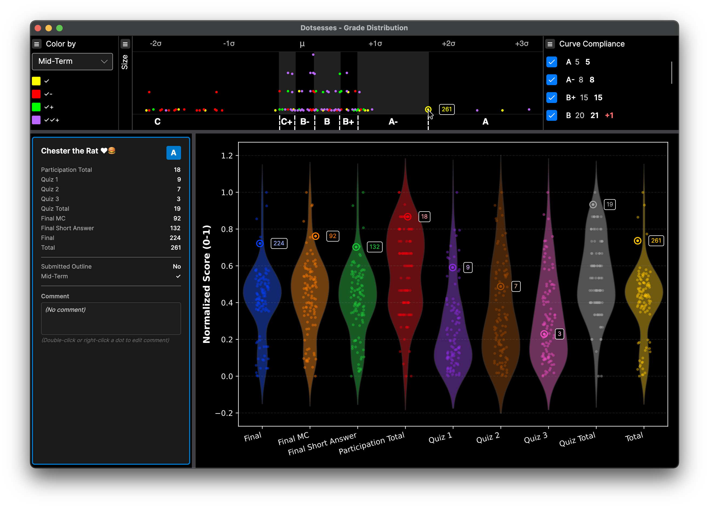

# Dotsesses

A cross-platform desktop application demonstrating Avalonia UI and CSnakes (Python interop for .NET) through an interactive grade distribution visualization tool.

## Table of Contents

- [Project Overview](#project-overview)
- [Work In Progress](#work-in-progress)
- [Key Features](#key-features)
- [Technologies](#technologies)
- [Architecture](#architecture)
- [Key Interactions](#key-interactions)
- [Getting Started](#getting-started)
- [Project Structure](#project-structure)
- [Configuration](#configuration)
- [Technical Highlights](#technical-highlights)
- [Development Notes](#development-notes)
- [License](#license)
- [Acknowledgments](#acknowledgments)

## Project Overview

Dotsesses visualizes student grade distributions using interactive dotplot histograms with drill-down capabilities. The application demonstrates modern .NET desktop development with cross-platform UI, MVVM patterns, and seamless Python integration for advanced visualizations.

The name is a playful take on incorrect pluralization of "dot," reflecting the application's whimsical, grade-school aesthetic.

## Key Features

### Interactive Visualization
- **Dotplot Histogram**: Student scores displayed as stacked dots with intelligent bin offsetting for visual clarity
- **Dynamic Grade Cursors**: Draggable cutoff lines with validation to prevent overlap
- **Hover Synchronization**: Coordinated hover effects between dotplot and violin plot views
- **Statistical Overlay**: Mean and standard deviation markers with automatic positioning
- **Alternating Grade Bands**: Subtle background regions that dynamically resize during cursor movement

### Data Exploration
- **Color-by-Attribute**: Dynamically color student markers by custom attributes (Yes/No, check marks, etc.)
- **Drill-Down Cards**: Click students to display detailed score breakdowns in formatted cards
- **Student Comments**: Visual indicators (square vs circle markers) for students with comments
- **Violin Plot Integration**: Python-generated violin plots with swarm overlays for distribution analysis
- **Dynamic Sizing**: Adjustable dot size via slider control

### Grade Management
- **Curve Compliance**: Live tracking of grade distribution against target curve policy
- **Enable/Disable Grades**: Toggle grade levels dynamically with automatic cursor recalculation
- **Deviation Tracking**: Color-coded indicators for grades above/below target counts




## Work In Progress

This project is under active development. The following features are planned for future releases:

- **Data Persistence**: Import and export student assessment data from CSV and JSON file formats
- **File Operations**: Save grade distributions, curve configurations, and student comments to persistent storage
- **Flexible Curve Policies**: Support for grade distributions using percentage ranges instead of exact count targets
- **Configurable Color Schemes**: User-defined color mappings for custom attribute values and categorical data
- **Cross-Platform Distribution**: Native application packages and installers for macOS, Windows, and Linux
- **Performance Optimization**: Asynchronous data processing to reduce UI blocking during plot generation and data updates

## Technologies

### Avalonia UI (11.3.6)
Cross-platform .NET UI framework providing native-like experiences on Windows, macOS, and Linux.

**Demonstrated Capabilities:**
- XAML-based declarative UI with compiled bindings
- Custom control templates and styling
- Complex multi-axis plotting integration
- Responsive layouts with SplitView and Grid
- Mouse event handling with coordinate transformations
- SVG rendering via Avalonia.Svg.Skia

### CSnakes (1.2.1)
Python interop library for .NET enabling seamless integration of Python libraries.

**Integration Details:**
- Python environment setup via `IPythonEnvironment`
- Type-safe Python module interfaces generated from `.py` files
- Bi-directional data marshaling (C# ↔ Python)
- matplotlib/seaborn integration for violin plots
- SVG generation and metadata extraction from Python

**Python Dependencies:**
- matplotlib (plotting backend)
- seaborn (statistical visualizations)
- pandas/numpy (data processing)

### CommunityToolkit.Mvvm (8.2.1)
Source generators for MVVM pattern implementation.

**Features Used:**
- `[ObservableProperty]` for automatic property change notifications
- `[RelayCommand]` for command implementations
- `IMessenger` for loosely-coupled component communication
- Partial classes with code generation

### OxyPlot (2.1.0)
High-performance plotting library for .NET.

**Advanced Usage:**
- Multi-axis layouts (three separate Y-axes sharing one X-axis)
- Dynamic annotation updates during drag operations
- Custom hit-testing with screen-space distance calculations
- Fixed pixel-height regions with proportional scaling

## Architecture

### MVVM Pattern
The application follows strict Model-View-ViewModel separation:

- **ViewModels**: Inherit from `ViewModelBase` (extends `ObservableObject`)
- **View Location**: Convention-based resolution (`*ViewModel` → `*View`)
- **Data Binding**: Compiled bindings with `x:DataType` attributes
- **Validation**: CommunityToolkit validation with disabled DataAnnotations to prevent conflicts

### Messaging Pattern
Loosely-coupled communication between components using `IMessenger`:

- `StudentHoverMessage`: Synchronize hover state between dotplot and violin plot
- `StudentEditedMessage`: Trigger plot refresh after comment edits
- `EditStudentMessage`: Open comment editor for student

**Design Pattern:**
- Messages include `Source` field to prevent feedback loops
- ViewModels ignore messages originating from themselves
- Enables bidirectional synchronization without tight coupling

### Python Integration
CSnakes provides type-safe access to Python functionality:

```csharp
public class ViolinPlotService
{
    private readonly IViolinSwarm _violinModule;

    public ViolinPlotService(IPythonEnvironment env)
    {
        _violinModule = env.ViolinSwarm();
    }

    public (string SvgContent, List<ViolinDataPoint> DataPoints) GeneratePlot(...)
    {
        var result = _violinModule.CreateViolinSwarmPlot(...);
        // SVG string and point metadata returned from Python
    }
}
```

**Python Module (`violin_swarm.py`):**
- Generates violin plots with seaborn
- Embeds metadata in SVG for interactive overlays
- Returns both SVG content and point coordinates for C# rendering
- Maintains dark theme consistency

### Three-Part Plot Layout
Single OxyPlot instance with three coordinate systems:

1. **Statistics Display** (top, 30px fixed)
   - Mean (μ) and standard deviations (±nσ)
   - Shared X-axis with other regions

2. **Dot Display** (middle, variable height)
   - Student score histogram
   - Alternating grade region bands
   - Resizable via splitter

3. **Grade Cursors** (bottom, 30px fixed)
   - Draggable cutoff lines
   - Grade labels centered between cursors

**Alignment Strategy:**
- All three regions use the same `SharedX` axis key
- Separate Y-axes with `StartPosition`/`EndPosition` for vertical layout
- Proportional scaling maintained during window resize

## Key Interactions

### Hover Synchronization
Hovering in either visualization highlights the same student in both views:

1. User hovers over dot in dotplot
2. `MainWindowViewModel` sends `StudentHoverMessage` with `Source="dotplot"`
3. `ViolinPlotViewModel` receives message and sets `HoveredStudentId`
4. Violin plot highlights corresponding points
5. Reverse flow works identically for violin → dotplot

### Tooltip Display
Custom tooltip shows student details on hover:
- Muppet name (whimsical identifier)
- Aggregate score
- Individual score components
- Student attributes
- Grade assignment

### Comment Editing
Multiple ways to open comment editor:
- Double-click student dot
- Right-click student dot
- Shows modal dialog with text entry
- Comment presence indicated by square vs circle marker

### Cursor Dragging
Click-and-drag grade cutoff cursors with validation:
- Horizontal proximity check (within 3 data units)
- Vertical bounds check (cursor region only)
- Overlap prevention (minimum 1-point separation)
- Live grade band updates during drag
- Compliance grid updates on release

## Getting Started

### Prerequisites
- .NET 9.0 SDK
- Python 3.10+ with pip (for CSnakes)

### Building the Project
```bash
# Clone repository
git clone <repository-url>
cd Dotsesses

# Restore dependencies (includes Python environment setup)
dotnet restore

# Build
dotnet build

# Run
dotnet run --project Dotsesses/Dotsesses.csproj
```

### Testing
```bash
# Run unit tests
dotnet test

# Run with snapshot capture (for visual verification)
dotnet run --project Dotsesses/Dotsesses.csproj -- --snapshot
```

## Project Structure

```
Dotsesses/
├── ViewModels/           # MVVM ViewModels with CommunityToolkit
│   ├── MainWindowViewModel.cs      # Main dotplot and coordination
│   ├── ViolinPlotViewModel.cs      # Python violin plot integration
│   ├── StudentCardViewModel.cs     # Drill-down card data
│   └── CursorViewModel.cs          # Grade cursor state
├── Views/                # Avalonia XAML views
│   ├── MainWindow.axaml            # Main application window
│   └── ViolinPlotView.axaml        # SVG violin plot display
├── Models/               # Data models and records
│   ├── StudentAssessment.cs        # Student score data
│   ├── Grade.cs                    # Grade definitions
│   └── ViolinDataPoint.cs          # Python plot metadata
├── Services/             # Business logic and data services
│   ├── ViolinPlotService.cs        # CSnakes Python bridge
│   └── SyntheticStudentGenerator.cs # Test data generation
├── Calculators/          # Grade calculation algorithms
│   ├── InitialCutoffCalculator.cs  # Cursor placement logic
│   ├── CutoffCountCalculator.cs    # Grade distribution counting
│   └── CursorValidation.cs         # Drag constraint validation
├── Messages/             # IMessenger message types
│   ├── StudentHoverMessage.cs
│   └── StudentEditedMessage.cs
├── Python/               # Python modules for CSnakes
│   └── Violin/
│       ├── violin_swarm.py         # Violin plot generation
│       └── pyproject.toml          # Python dependencies
└── Assets/               # Application resources
```

## Configuration

### Python Environment
CSnakes automatically manages Python environment setup. Dependencies are specified in `Python/Violin/pyproject.toml`:

```toml
[project]
dependencies = [
    "matplotlib>=3.7.0",
    "seaborn>=0.12.0",
    "pandas>=2.0.0",
    "numpy>=1.24.0"
]
```

### Dependency Injection
Services configured in `App.axaml.cs`:
```csharp
var services = new ServiceCollection();
services.AddSingleton<IPythonEnvironment>(...);
services.AddSingleton<ViolinPlotService>();
services.AddSingleton<IMessenger>(WeakReferenceMessenger.Default);
```

## Technical Highlights

### Screen-Space Hit Testing
Click detection uses pixel coordinates for consistent behavior:

```csharp
// Transform data position to screen coordinates
var screenPoint = xAxis.Transform(dataPoint.X, dataPoint.Y, yAxis);

// Calculate pixel distance
double distance = Math.Sqrt(
    Math.Pow(screenPoint.X - clickPosition.X, 2) +
    Math.Pow(screenPoint.Y - clickPosition.Y, 2));

if (distance <= 10) // 10-pixel tolerance
{
    // Student selected
}
```

### Dynamic Color Mapping
Attribute-based coloring with legend generation:

```csharp
var color = value switch
{
    "Yes" => "#00FF00",      // Green
    "No" => "#FF0000",       // Red
    "✓✓+" => "#BB66FF",      // Bright Purple
    "✓+" => "#00FF00",       // Green
    "✓" => "#FFFF00",        // Yellow
    "✓-" => "#FF0000",       // Red
    _ => "#FFFFFF"           // White (default)
};
```

### Synthetic Data Generation
Realistic tri-modal distribution with correlated attributes:
- 5% high performers (>250 points)
- 75% middle performers (150-225 points)
- 20% low performers (50-125 points)
- 60% correlation between performance and attributes
- Whimsical "Muppet names" with emoji decorations

## Development Notes

### Compiled Bindings
Avalonia's compiled bindings provide type safety and performance:

```xml
<Window x:DataType="vm:MainWindowViewModel">
    <TextBlock Text="{Binding HoveredStudent.Name}"/>
</Window>
```

**Benefits:**
- Compile-time validation
- No reflection overhead
- IntelliSense support

### Coordinate Systems
Multiple coordinate systems require careful axis management:

- **Data Space**: Plot coordinate values
- **Screen Space**: Pixel coordinates
- **Transformations**: `axis.Transform()` and `axis.InverseTransform()`
- Each Y-axis (StatsY, DotY, CursorY) has independent coordinate ranges

## License

MIT License

Copyright (c) 2025 Dotsesses Contributors

Permission is hereby granted, free of charge, to any person obtaining a copy
of this software and associated documentation files (the "Software"), to deal
in the Software without restriction, including without limitation the rights
to use, copy, modify, merge, publish, distribute, sublicense, and/or sell
copies of the Software, and to permit persons to whom the Software is
furnished to do so, subject to the following conditions:

The above copyright notice and this permission notice shall be included in all
copies or substantial portions of the Software.

THE SOFTWARE IS PROVIDED "AS IS", WITHOUT WARRANTY OF ANY KIND, EXPRESS OR
IMPLIED, INCLUDING BUT NOT LIMITED TO THE WARRANTIES OF MERCHANTABILITY,
FITNESS FOR A PARTICULAR PURPOSE AND NONINFRINGEMENT. IN NO EVENT SHALL THE
AUTHORS OR COPYRIGHT HOLDERS BE LIABLE FOR ANY CLAIM, DAMAGES OR OTHER
LIABILITY, WHETHER IN AN ACTION OF CONTRACT, TORT OR OTHERWISE, ARISING FROM,
OUT OF OR IN CONNECTION WITH THE SOFTWARE OR THE USE OR OTHER DEALINGS IN THE
SOFTWARE.

## Acknowledgments

Built with:
- [Avalonia UI](https://avaloniaui.net/) - Cross-platform .NET UI framework
- [CSnakes](https://github.com/tonybaloney/CSnakes) - Python integration for .NET
- [OxyPlot](https://oxyplot.github.io/) - .NET plotting library
- [CommunityToolkit.Mvvm](https://learn.microsoft.com/dotnet/communitytoolkit/mvvm/) - MVVM helpers and source generators
