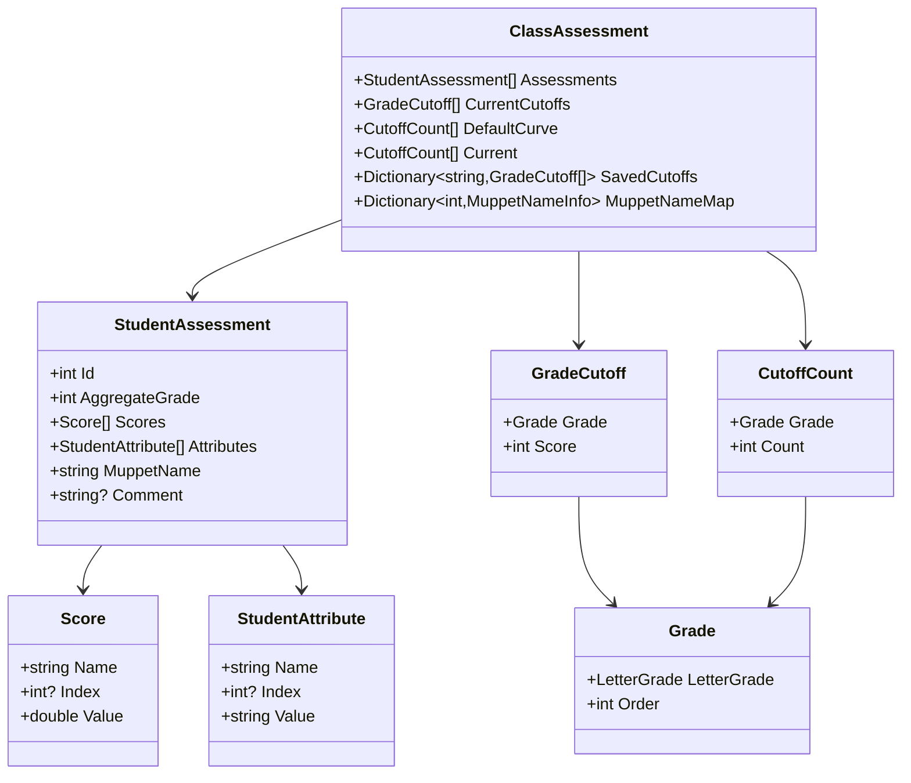

# Dotsesses Specification

## Overview

Dotsesses visualizes aggregate student grades as dotplot histograms with hover-based drill-down and interactive cursors for grade cutoffs. It shows score distributions, individual components via violin plots, and helps assign letter grades that match the school's curve policy.

The name is a play on incorrect pluralization of "dot". The theme is playful and reminiscent of early grade school.

## User Experience

**Note:** All visualizations are data-driven. The number of grade regions varies based on which grades are enabled. Statistical markers (mean, standard deviations) are calculated from the current dataset and do not change when grades are enabled/disabled.

### Interaction Model

The application uses **hover-based interaction** for all student data viewing:
- Hovering over dots (in dotplot or violin plot) displays student details in the drill-down panel
- Double-click or right-click a dot to open the comment editor
- Hover state is synchronized between dotplot and violin plot
- No persistent selection - hover state changes as mouse moves

### Layout

The main window uses a two-row layout with resizable splitters:

**Top Section - Fixed 175px Height:**
Left-to-right layout:
1. **Color Selection Panel** - Collapsible side panel for coloring dots by attribute
2. **Size Panel** - Collapsible side panel with slider to adjust dot size
3. **Three-Part Dotplot** - Main visualization (Statistics, Dot Display, Grade Cursors)
4. **Curve Compliance Panel** - Collapsible side panel showing grade distribution

**Horizontal Splitter:**
- Subtle horizontal splitter between top and bottom sections
- Dragging adjusts only Dotplot height (Statistics and Grade Cursors areas remain fixed at ~30px each)

**Bottom Section - Variable Height:**
Left-to-right layout with vertical splitter:
1. **Drill-Down Panel** (left, 300px initial) - Shows hovered student details
2. **Violin Plot Panel** (right, fills remaining space) - Multi-series violin plot with swarm overlay

All collapsible panels use hamburger menu icons with rotated text in collapsed state.

### Dotplot Visualization

The Dot Display is the middle rendering area of the three-part plot. Scores are distributed horizontally on a dotplot histogram with alternating grade region bands in the background.

#### X-Axis Positioning

Aggregate score determines x-axis position. Lowest score on the left, highest on the right, both with padding.

**Padding:** Use 10 units on the left (total number of letter grades) to leave space for all grade cursors.

#### Y-Axis Positioning

Students with identical aggregate scores stack vertically, ordered by student ID for consistent positioning across redraws. Dot spacing is double the marker size.

**Bin Offset:** Bins with odd aggregate scores (e.g., 281, 283, 285) receive a +0.1 y-axis offset. All dots in that bin shift up by 0.1 to make adjacent bins more visually distinct.

**Y-Axis Padding:** Top and bottom padding equals `max_students_in_bin × 0.1`. For example, if the maximum number of students at any score is 8, padding is 0.8 on both top and bottom.

#### Scaling

Dot Display stretches horizontally to fill available width and autoscales vertically within its allocated height (controlled by splitter) to fit the maximum number of students in a bin.

#### Hover

Hovering over a point displays the student's data in the drill-down panel and broadcasts a hover message to synchronize with the violin plot.

#### Click Detection

All click detection uses screen space (pixel) coordinates to ensure consistent behavior regardless of data scale or zoom level.

**Student Interaction:**
- Uses Euclidean distance in screen space (pixels)
- Hover detection occurs when within 10 pixels of a student dot
- Distance formula: `sqrt((screenX - dotScreenX)² + (screenY - dotScreenY)²)`
- Click must be within Dot Display Y-axis bounds (between DotY minimum and maximum)
- Double-click or right-click opens comment editor for that student

**Cursor Dragging:**
- Horizontal proximity check: cursor must be within 3 data units of click X position
- Vertical bounds check: click Y position must be within Grade Cursors area bounds
- Uses cursor Y-axis transformation to validate click is in cursor region
- Only then initiates cursor drag operation
- This prevents accidental cursor dragging when clicking on grade region band edges in Dot Display

**Coordinate Transformations:**
- Screen space: pixel coordinates from mouse events (ScreenPoint)
- Data space: coordinate values on plot axes (DataPoint)
- Use `axis.Transform(x, y)` to convert data → screen
- Use `axis.InverseTransform(screenPoint)` to convert screen → data
- Different Y-axes (DotY, CursorY, StatsY) have separate coordinate spaces

#### Dot Appearance

- **Size:** Adjustable via Size slider (range 2-10, default 2)
- **Shape:**
  - Circle (filled) for students without comments
  - Square (hollow) for students with comments
- **Color:**
  - White by default (when no attribute selected)
  - Colored by attribute value when color-by-attribute is enabled
- **Background:** RGB(0, 0, 0) matching all other controls

#### Color-by-Attribute

The Color Selection panel allows coloring dots by student attributes:
- Dropdown to select attribute (default: "[None]")
- Color legend displays distinct values and their colors
- Each unique attribute value gets its own color
- Predefined color mapping for common values:
  - "Yes" → Green (#00FF00)
  - "No" → Red (#FF0000)
  - "✓✓+" → Bright Purple (#BB66FF)
  - "✓+" → Green (#00FF00)
  - "✓" → Yellow (#FFFF00)
  - "✓-" → Red (#FF0000)
  - Default → White (#FFFFFF)
- Separate series for circles and squares to preserve marker type distinction

#### Grade Region Bands

Alternating subtle background rectangles indicate grade regions between cursors.

**Visual Style:**
- Alternating pattern: transparent (clear) and semi-transparent white
- White color: RGB(255, 255, 255) with alpha 0x20
- Rectangles span full height of Dot Display area

**Behavior:**
- Dynamically resize based on cursor positions as they are dragged
- Only drawn for enabled grades (when cursor checkbox is checked)
- When a grade cursor is disabled, its region band disappears
- Number of bands varies with dataset (depends on how many grades are enabled)

**Example:** If grades A, A-, B+, B are enabled, there would be 5 regions with alternating transparency (include ends).

#### Axis Display

- **X-Axis:** Hidden (no line, no ticks, no labels)
- **Y-Axis:** Hidden (no line, no ticks, no labels)
- **Borders:** Full outline (top, left, right, bottom) with thin gray line
- **Title:** None

### Statistics Display

The Statistics Display is the top rendering area of the three-part plot, showing statistical labels for the dataset.

#### Labels

**Mean (μ):**
- Label: "μ" vertically centered in Statistics Display area
- Font size: 16px
- Color: Light gray RGB(180, 180, 180)

**Standard Deviations (±σ):**
- Labels: "+1σ", "-1σ", "+2σ", "-2σ", etc. vertically centered in Statistics Display area
- Show as many standard deviations as exist within the score range
- Do not draw labels that exceed the min/max score range
- Font size: 14px
- Color: Light gray RGB(180, 180, 180)

#### Behavior

- Statistics are calculated from the current dataset
- **Statistics do not change when grade cursors are enabled/disabled**
- Fixed height rendering area (~30px)
- Shares x-axis range with Dot Display and Grade Cursors

#### Borders

- Thin rectangle border (top, left, right, bottom)
- Color: RGB(60, 60, 60)
- Thickness: 1px

### Grade Cursors

The Grade Cursors rendering area (bottom of the three-part plot) displays draggable vertical lines for grade cutoffs.

**Visual Style:**
- Dashed vertical cursors show grade cutoffs (only when enabled via checkboxes)
- Letter grade labels appear **below the cursors** in the Grade Cursors area
  - Labels centered between each cursor and its right neighbor
  - For the highest grade, label centered between cursor and right boundary
  - The lowest grade has no cursor; its label centered between left boundary and second-lowest grade's cursor
- Label styling:
  - Font size: 16px
  - Font weight: Bold
  - Color: White RGB(255, 255, 255)
- Fixed height rendering area (~30px)
- Thin rectangle border (top, left, right, bottom)
  - Color: RGB(60, 60, 60)
  - Thickness: 1px

**Interaction:**
- Cursors are draggable but cannot overlap
  - Example: cursor for A cannot move left of or onto A-
  - **Cursors must be at least 1 point apart** on the score scale
- **No crosshairs appear when dragging**
- Visual feedback during drag: grade region bands in Dot Display dynamically resize
- **Enabling/disabling cursors triggers recalculation** of grade assignments and updates region bands

#### Initial Placement of Cursors

Algorithm:
1. Start with grades in the DefaultCurve
2. For each grade (starting from highest), assign cutoff to match target count
3. Allow overflow if multiple students are tied at boundary (fairness - don't split tied students)
4. Grades not in DefaultCurve start disabled

#### Enabling Additional Cursors

When a disabled cursor is enabled:

1. **If between existing cursors:** Place at middle of score range between neighbors
   - Example: A- at 280, B+ at 260 → place B at 270
2. **If at edge:** Place to the left/right of existing cursors
3. **If placement causes overlap:** Reset ALL enabled cursors to even spacing across score range (min to max)

### Drill-Down Panel

Left panel (300px initial width) shows details for the currently hovered student.

**Card Content:**
1. Header: MuppetName and assigned grade
2. Two-column table (Name | Value):
   - Scores appear first
   - Thin light gray separator line
   - Attributes appear below
   - No section headers ("Scores" / "Attributes")
   - Check symbols match text color (not dark gray)
3. Comment section:
   - Separator line
   - "Comment" label
   - Comment text box (read-only display)
   - Instruction text: "(Double-click or right-click a dot to edit comment)"

**Background:** RGB(0, 0, 0)

**Border:** Blue border (#007ACC) with 2px thickness when student is hovered

### Violin Plot

Right panel in bottom section shows multi-series violin plot with swarm overlay.

**Features:**
- Generated via Python (matplotlib/seaborn) through CSnakes integration
- SVG rendering with interactive dot overlays
- Synchronized hover with dotplot
- One series per score component (Quiz Total, Participation Total, Final)
- Violin shows distribution density
- Swarm dots show individual student scores
- Hollow squares for students with comments
- Filled circles for students without comments
- Click/double-click opens comment editor (same as dotplot)

**Interaction:**
- Hover over dots highlights corresponding student in dotplot
- Hover ring appears around all dots for that student (across all series)
- Tooltips show score values
- Dots dim when another student is hovered
- Responsive resizing with 300ms debounce to regenerate Python plot

**Technical:**
- SVG content generated by Python module via CSnakes
- Avalonia shapes overlay for hit testing and hover effects
- Coordinate transformation between SVG and display space
- Data points stored with student IDs for synchronized interaction

### Curve Compliance

The collapsible panel shows:
- Letter grades (display as "D-" not "DMinus")
- Target counts (from school's curve policy)
- Current counts
- Absolute deviation (only if > 0)
  - Negative deviations (below target): Light blue color
  - Positive deviations (above target): Red color

**Grade Checkboxes:** Checkboxes to the left of the table control which grades are enabled. Unchecking a grade hides its cursor and recalculates binning.

**Table Styling:**
- Vertical spacing: 50% of default
- Proper column alignment and spacing
- Background: RGB(0, 0, 0)

**Collapsible Behavior:**
- Hamburger menu icon to toggle
- Rotated "Curve Compliance" text when collapsed
- Full table when expanded

### Color Selection Panel

Collapsible side panel for color-by-attribute functionality:
- Dropdown to select attribute
- Color legend showing value-to-color mapping
- Hamburger menu icon to toggle
- Rotated "Color by" text when collapsed

### Size Panel

Collapsible side panel for adjusting dot size:
- Slider control (range 2-10, default 2)
- Current size display
- Hamburger menu icon to toggle
- Rotated "Size" text when collapsed
- Affects both dotplot and violin plot markers

### Student Comment System

Students can have multiline comments associated with them:
- Comments stored in `StudentAssessment.Comment` property
- Students with comments display as hollow squares (in both dotplot and violin plot)
- Students without comments display as filled circles
- Double-click or right-click any student dot opens comment editor dialog
- Comments visible in drill-down panel
- Changes trigger refresh of both dotplot and violin plot

### Export

Export to Excel with columns for student ID, aggregate score, individual scores, attributes, and final grade.

## Data Model

### Conventions

- All arrays expose as IReadOnlyCollection unless otherwise stated.
- "immutable" means use record classes or the current preferred immutable pattern.

### Class Hierarchy



### StudentAssessment

```csharp
class StudentAssessment
{
    int Id
    int AggregateGrade              // calculated property with caching, sum of Scores (converted to int)
    Score[] Scores                  // individual numeric scores
    StudentAttribute[] Attributes   // non-numeric data like "Accommodation"
    string MuppetName               // whimsical identifier (see MuppetName Generation)
    string? Comment                 // optional multiline comment
}
```

### immutable Score

```csharp
record Score
{
    string Name    // e.g., "Quiz", "Final"
    int? Index     // for Quiz 1, Quiz 2, etc (null for single scores like "Final")
    double Value
}
```

### immutable StudentAttribute

```csharp
record StudentAttribute
{
    string Name    // e.g., "Submitted Outline", "Mid-Term"
    int? Index     // for Attended Study Session 1, Attended Study Session 2, etc
    string Value   // e.g., "Yes", "No", "Maybe", "✔✔+"
}
```

### immutable Grade

```csharp
record Grade
{
    LetterGrade LetterGrade   // A, A-, B+, B, B-, C+, C, D, D-, F
    int Order                  // A=0, A-=1, etc
}
```

### immutable GradeCutoff

```csharp
record GradeCutoff
{
    Grade Grade
    int Score   // actual score threshold for this grade (e.g., "A = 285")
}
```

### immutable CutoffCount

```csharp
record CutoffCount
{
    Grade Grade
    int Count   // number of students in this grade
}
```

### ClassAssessment

```csharp
class ClassAssessment
{
    StudentAssessment[] Assessments                    // all student assessments
    GradeCutoff[] CurrentCutoffs                       // actual score thresholds for each grade
    CutoffCount[] DefaultCurve                         // school's default grade distribution
    CutoffCount[] Current                              // counts of students in each grade with current cutoffs
    Dictionary<string, GradeCutoff[]> SavedCutoffs     // user-named saved cutoff configurations
    Dictionary<int, MuppetNameInfo> MuppetNameMap      // mapping of student ID to MuppetName data
}
```

### MuppetName Generation

Each student gets a whimsical "MuppetName" instead of showing their numeric ID.

**Structure:** `[Muppet Name] [Emojis]`

**Examples:**
- "Kermit the Frog 🐸🎭🎪"
- "Cookie Monster 🍪🎨🎈"
- "Elmo 🔴🎪🎨"

**Generation Algorithm:**
1. Order students by ID
2. Use constant seed (42) for random generator
3. For each student, randomly select from Muppet Wiki character list:
   - Unique Muppet name
   - 1-3 random emojis
4. Ensure uniqueness within the class (if duplicate, reroll)
5. Store as MuppetNameInfo (name + emojis) in ClassAssessment

**Note:** Student IDs don't need consistent MuppetNames across different ClassAssessments.

## Technical Architecture

### Technology Stack

- **Framework**: .NET 9.0
- **UI Framework**: Avalonia 11.3.6
- **MVVM Toolkit**: CommunityToolkit.Mvvm 8.2.1
- **Plotting Library**: OxyPlot.Avalonia 2.1.0-Avalonia11
- **Python Integration**: CSnakes.Runtime (for violin plot generation)
- **Excel Export**: ClosedXML
- **Logging**: Serilog with rolling file appenders
- **Testing**: xUnit
- **Theme**: Dark theme variant

### MVVM Pattern

- ViewModels inherit from `ViewModelBase` (extends `ObservableObject`)
- Convention-based View resolution via `ViewLocator`
- Compiled bindings enabled by default

### Messaging System

Uses CommunityToolkit.Mvvm.Messaging for cross-component communication:

**StudentHoverMessage:**
- Synchronizes hover state between dotplot and violin plot
- Contains: StudentId, Source ("dotplot" or "violin"), ScreenPosition (optional)
- Prevents infinite message loops by checking source

**EditStudentMessage:**
- Triggers comment editor dialog for a specific student
- Sent on double-click or right-click of student dots

**StudentEditedMessage:**
- Broadcast after student comment is saved
- Triggers refresh of dotplot and violin plot visualizations

### Python Integration (CSnakes)

Violin plots are generated via Python integration using CSnakes:

**ViolinPlotService:**
- Wraps Python module for violin plot generation
- Converts .NET data structures to Python-compatible format
- Returns SVG content and data point coordinates
- Uses matplotlib/seaborn for plotting

**Python Module (violin_swarm.py):**
- `create_violin_swarm_plot()` function
- Generates violin plot with swarm overlay
- Normalizes scores to 0-1 range for consistent visualization
- Returns tuple of (plot object, SVG string, point data)
- Point data includes (x, y) coordinates in SVG space for hit testing

**Data Flow:**
1. MainWindowViewModel prepares series data from StudentAssessments
2. ViolinPlotViewModel calls ViolinPlotService
3. Service invokes Python module via CSnakes
4. Python returns SVG and point coordinates
5. ViolinPlotControl displays SVG and overlays interactive shapes
6. Coordinate transformations enable hover detection and synchronization

### Dependency Injection

- Use Microsoft's framework
- Single class for dependency configuration
- Services registered: ViolinPlotService, IMessenger, ViewModels

### Logging

- Use Serilog with ILog interface wrapper
- Log all UI user inputs at debug level
- Rolling file appenders for debug and info levels
- Cap log files at 100K or 30 days

### Exception Handling

- Exceptions rise to a global application handler
- Handler displays error message with stack trace that can be copied to clipboard

### Update Behavior

#### Cursor Movement Calculation

Async updates with 25ms delay and cancellation:

1. Trigger calculation on cursor move
2. Wait 25ms
3. Check cancellation token (cursor moved again?)
4. If cancelled, abort
5. If not cancelled, recalculate on background thread
6. Check cancellation token before UI update
7. Update UI only if not cancelled

Avoids unnecessary calculations during rapid cursor movement.

#### Update Flow

When cursors change:
1. Build GradeCutoff[] from cursor positions
2. Background calculator receives StudentAssessments and GradeCutoffs
3. Returns IReadOnlyCollection<CutoffCount>
4. Assign to ClassAssessment.Current
5. Update compliance table

#### Violin Plot Resize Behavior

When control size changes:
1. Immediately update dot positions to match SVG scaling
2. Debounce full plot regeneration (300ms delay)
3. Cancel previous regeneration if new resize occurs
4. Regenerate Python plot with new dimensions when debounce completes

### Project Structure

```
Dotsesses/
├── ViewModels/       # MVVM ViewModels (MainWindow, ViolinPlot, StudentCard, etc.)
├── Views/            # Avalonia UserControls and Windows
├── Models/           # Data models (StudentAssessment, Score, Grade, etc.)
├── Calculators/      # Grade calculation logic
├── Services/         # ViolinPlotService, data generation, MuppetName generation
├── Messages/         # Messenger classes (StudentHoverMessage, EditStudentMessage, etc.)
└── Assets/           # Application resources
```

## Implementation Details

### Synthetic Test Data

#### Grades

Generate random data for 100 students with three score components:
- Quiz Total (20 pts)
- Participation Total (20 pts)
- Final (300 pt)

Tri-modal distribution:
- 5% high performers: aggregate score >250
- 75% middle: aggregate score 150-225
- 20% low performers: aggregate score 50-125

#### Attributes

Generate with **60% correlation, 40% independent** for realistic variation:

- **High performers (5%)**
  - "Submitted Outline" : "Yes"
  - "Mid-Term": "✔✔+"

- **Middle (75%)**
  - "Submitted Outline" : 70% "Yes", 30% "No"
  - "Mid-Term": 70% "✔✔+", 20% "✔+", 10% "✔"

- **Low performers (20%)**
  - "Submitted Outline" : 10% "Yes", 90% "No"
  - "Mid-Term": 20% "✔", 80% "✔-"

**Implementation:** 60% of students get attributes matching their performance group. 40% roll independently.

#### Default School Curve

Standard curve: A, A-, B+, B, B-, C+, and C. Grades below C are not required.

## Testing Strategy

### Unit Testing

#### Calculators
- All calculator classes must have unit tests

#### ViewModels
- All ViewModels must have unit tests
- Cursor changes with validation of student grade counts
- Cursor changes at a variety of speeds

#### Services
- ViolinPlotService integration tests (requires Python environment)
- Test data format conversions and coordinate transformations

### View Testing

The application supports automated snapshot capture for UI verification by Claude Code.

#### Snapshot Command Line Arguments

The application accepts the following command line arguments for snapshot mode:

- `--snapshot` or `--capture-snapshot`: Triggers snapshot mode. The app will launch, render the window, capture a PNG snapshot, print the file path to stdout, and exit.
- `--output <path>` or `-o <path>`: Optional. Specifies the output path for the snapshot. If not provided, saves to temp folder with timestamp.

#### Snapshot Implementation

The `SaveSnapshotAsync` method in `MainWindow.axaml.cs` handles snapshot capture:
- Determines output path (uses temp folder with timestamp if not specified)
- Waits 200ms for rendering to complete
- Forces layout update
- Renders window to bitmap at 96 DPI
- Saves as PNG with maximum quality (100)
- Returns full file path

#### Claude Code Workflow

When Claude Code needs to verify UI changes:

1. **Run snapshot command**:
   ```bash
   dotnet run --project Dotsesses/Dotsesses.csproj -- --snapshot
   ```

2. **Capture output**: The app prints the snapshot path to stdout:
   ```
   Snapshot saved to: /var/folders/.../dotsesses_snapshot_20251008_001717.png
   ```

3. **Read snapshot**: Use the Read tool with the returned file path to view the UI

4. **Iterate**: Make code changes and repeat to verify visual alignment

This workflow enables Claude Code to visually verify UI tweaks like cursor alignment, spacing, colors, and layout without manual inspection.

## Design History

See `design_history/` folder for detailed design decisions and clarifications.
