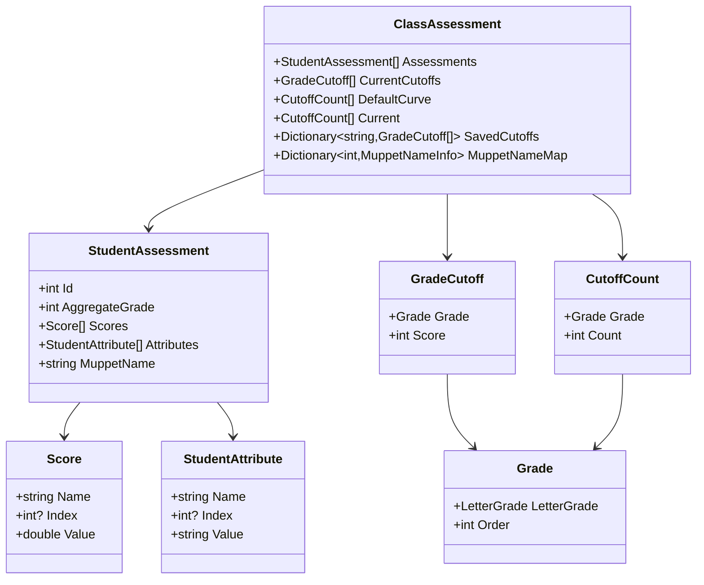

# Dotsesses Specification

## Overview

Dotsesses visualizes aggregate student grades as dotplot histograms with drill-down
and interactive cursors for grade cutoffs. It shows score distributions,
individual components, and helps assign letter grades that match the school's curve policy.

The name is a play on incorrect pluralization of "dot". The theme is playful and
reminiscent of early grade school.

## User Experience

### Dotplot Visualization

Scores are distributed horizontally on a dotplot histogram that stretches across the top
of the main window.

#### X-Axis Positioning

Aggregate score determines x-axis position. Lowest score on the left, highest on the right, both with padding.

**Padding:** Use 10 units on the left (total number of letter grades) to leave space for all grade cursors.

#### Y-Axis Positioning

Students with identical aggregate scores stack vertically, ordered by student ID for consistent positioning across redraws. Dot spacing is double the marker size.

#### Scaling

Dotplot stretches horizontally and autoscales vertically to fit the maximum number of students in a bin.

#### Hover

Hovering over a point displays a formatted summary table of the student's scores and attributes, organized by name and index (if present).

#### Selection

Click a point to toggle selection. **Selection persists when cursors move.**

### Drill Down

The area below the dotplot shows selected students as cards in a horizontally-stretched container.
Cards flow left to right, then down. A vertical scrollbar appears when cards don't fit.

**Card Content (top to bottom):**
1. MuppetName and assigned grade (header)
2. Scores table (consistently sorted)
3. Attributes table (consistently sorted)

### Curve Compliance

A grid in the bottom right corner shows:
- Letter grades
- Target counts (from school's curve policy)
- Current counts
- Absolute deviation (only if > 0)

**Grade Checkboxes:** Checkboxes to the left of the table control which grades are enabled. Unchecking a grade hides its cursor and recalculates binning.

### Cursors

- Dashed vertical cursors show grade cutoffs (only when enabled via checkboxes).
- Letter grade labels appear centered between each cursor and its right neighbor. For the highest grade, the label is centered between the cursor and right boundary.
- The lowest grade has no cursor. Its label is centered between the left boundary and the second-lowest grade's cursor.
- Labels are **semi-transparent (fixed level)** and use a larger font than other text.
- Cursors are draggable but cannot overlap.
  - Example: cursor for A cannot move left of or onto A-.
  - **Cursors must be at least 1 point apart** on the score scale.

#### Initial Placement of Cursors

Algorithm:
1. Start with grades in the DefaultCurve
2. For each grade (starting from highest), assign cutoff to match target count
3. Allow overflow if multiple students are tied at boundary (fairness - don't split tied students)
4. Grades not in DefaultCurve start disabled

#### Enabling Additional Cursors

When a disabled cursor is enabled:

1. **If between existing cursors:** Place at middle of score range between neighbors
   - Example: A- at 280, B+ at 260 → place B at 270
2. **If at edge:** Place to the left/right of existing cursors
3. **If placement causes overlap:** Reset ALL enabled cursors to even spacing across score range (min to max)

### Export

Export to Excel with columns for student ID, aggregate score, individual scores, attributes, and final grade.

## Data Model

### Conventions

- All arrays expose as IReadOnlyCollection unless otherwise stated.
- "immutable" means use record classes or the current preferred immutable pattern.

### Class Hierarchy



### StudentAssessment

```csharp
class StudentAssessment
{
    int Id
    int AggregateGrade              // calculated property with caching, sum of Scores (converted to int)
    Score[] Scores                  // individual numeric scores
    StudentAttribute[] Attributes   // non-numeric data like "Accommodation"
    string MuppetName               // whimsical identifier (see MuppetName Generation)
}
```

### immutable Score

```csharp
record Score
{
    string Name    // e.g., "Quiz", "Final"
    int? Index     // for Quiz 1, Quiz 2, etc (null for single scores like "Final")
    double Value
}
```

### immutable StudentAttribute

```csharp
record StudentAttribute
{
    string Name    // e.g., "Submitted Outline", "Mid-Term"
    int? Index     // for Attended Study Session 1, Attended Study Session 2, etc
    string Value   // e.g., "Yes", "No", "Maybe", "✔✔+"
}
```

### immutable Grade

```csharp
record Grade
{
    LetterGrade LetterGrade   // A, A-, B+, B, B-, C+, C, D, D-, F
    int Order                  // A=0, A-=1, etc
}
```

### immutable GradeCutoff

```csharp
record GradeCutoff
{
    Grade Grade
    int Score   // actual score threshold for this grade (e.g., "A = 285")
}
```

### immutable CutoffCount

```csharp
record CutoffCount
{
    Grade Grade
    int Count   // number of students in this grade
}
```

### ClassAssessment

```csharp
class ClassAssessment
{
    StudentAssessment[] Assessments                    // all student assessments
    GradeCutoff[] CurrentCutoffs                       // actual score thresholds for each grade
    CutoffCount[] DefaultCurve                         // school's default grade distribution
    CutoffCount[] Current                              // counts of students in each grade with current cutoffs
    Dictionary<string, GradeCutoff[]> SavedCutoffs     // user-named saved cutoff configurations
    Dictionary<int, MuppetNameInfo> MuppetNameMap      // mapping of student ID to MuppetName data
}
```

### MuppetName Generation

Each student gets a whimsical "MuppetName" instead of showing their numeric ID.

**Structure:** `[Size/Color/Adjective] [Character] [Emojis]`

**Examples:**
- "Large Purple Kermit 🐸🎭🎪"
- "Tiny Blue Cookie Monster 🍪🎨🎈"
- "Fuzzy Orange Elmo 🔴🎪🎨"

**Generation Algorithm:**
1. Order students by ID
2. Use constant seed for random generator
3. For each student, randomly select unique combination:
   - Descriptor (size/color/adjective)
   - Character (candy, cute animal, muppet, cartoon character)
   - 1-3 emojis
4. Ensure uniqueness within the class (if duplicate, reroll)
5. Store mapping in ClassAssessment

**Note:** Student IDs don't need consistent MuppetNames across different ClassAssessments.

## Technical Architecture

### Technology Stack

- **Framework**: .NET 9.0
- **UI Framework**: Avalonia 11.3.6
- **MVVM Toolkit**: CommunityToolkit.Mvvm 8.2.1
- **Plotting Library**: OxyPlot.Avalonia 2.1.0-Avalonia11
- **Theme**: Dark theme variant

### MVVM Pattern

- ViewModels inherit from `ViewModelBase` (extends `ObservableObject`)
- Convention-based View resolution via `ViewLocator`
- Compiled bindings enabled by default

### Dependency Injection

- Use Microsoft's framework
- Single class for dependency configuration

### Logging

- Log through ILog interface
- Log all UI user inputs at debug level
- Use rolling file appenders for debug and info levels
- Cap log files at 100K or 30 days

### Exception Handling

- Exceptions rise to a global application handler
- Handler displays error message with stack trace that can be copied to clipboard

### Update Behavior

#### Cursor Movement Calculation

Async updates with 25ms delay and cancellation:

1. Trigger calculation on cursor move
2. Wait 25ms
3. Check cancellation token (cursor moved again?)
4. If cancelled, abort
5. If not cancelled, recalculate on background thread
6. Check cancellation token before UI update
7. Update UI only if not cancelled

Avoids unnecessary calculations during rapid cursor movement.

#### Update Flow

When cursors change:
1. Build GradeCutoff[] from cursor positions
2. Background calculator receives StudentAssessments and GradeCutoffs
3. Returns IReadOnlyCollection<CutoffCount>
4. Assign to ClassAssessment.Current
5. Update compliance table

### Project Structure

```
Dotsesses/
├── ViewModels/       # MVVM ViewModels
├── Views/            # Avalonia UserControls and Windows
├── Models/           # Data models
├── Calculators/      # Grade calculation logic
├── Services/         # Data generation, MuppetName generation
└── Assets/           # Application resources
```

## Implementation Details

### Synthetic Test Data

#### Grades

Generate random data for 100 students with three score components:
- Quiz Total (20 pts)
- Participation Total (20 pts)
- Final (300 pt)

Tri-modal distribution:
- 5% high performers: aggregate score >250
- 75% middle: aggregate score 150-225
- 20% low performers: aggregate score 50-125

#### Attributes

Generate with **60% correlation, 40% independent** for realistic variation:

- **High performers (5%)**
  - "Submitted Outline" : "Yes"
  - "Mid-Term": "✔✔+"

- **Middle (75%)**
  - "Submitted Outline" : 70% "Yes", 30% "No"
  - "Mid-Term": 70% "✔✔+", 20% "✔+", 10% "✔"

- **Low performers (20%)**
  - "Submitted Outline" : 10% "Yes", 90% "No"
  - "Mid-Term": 20% "✔", 80% "✔-"

**Implementation:** 60% of students get attributes matching their performance group. 40% roll independently.

#### Default School Curve

Standard curve: A, A-, B+, B, B-, C+, and C. Grades below C are not required.

## Testing Strategy

### Unit Testing

#### Calculators
- All calculator classes must have unit tests

#### ViewModels
- All ViewModels must have unit tests
- Cursor changes with validation of student grade counts
- Cursor changes at a variety of speeds

### View Testing

The window must save PNG snapshots to a temp folder and return the file path. This allows Claude Code to verify UI design. The window must be callable from a test executable that accepts command line arguments to set initial state.

## Design History

See `design_history/` folder for detailed design decisions and clarifications.
