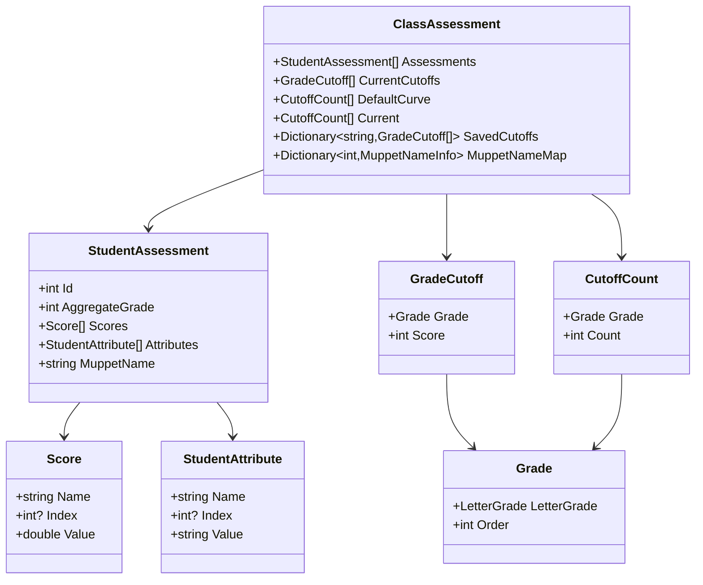

# Dotsesses Specification

## Overview

Dotsesses visualizes aggregate student grades as dotplot histograms with drill-down
and interactive cursors for grade cutoffs. It shows score distributions,
individual components, and helps assign letter grades that match the school's curve policy.

The name is a play on incorrect pluralization of "dot". The theme is playful and
reminiscent of early grade school.

## User Experience

**Note:** All visualizations are data-driven. The number of grade regions varies based on which grades are enabled. Statistical markers (mean, standard deviations, median) are calculated from the current dataset and do not change when grades are enabled/disabled.

### Dotplot Visualization

The Dot Display is the middle rendering area of the three-part plot. Scores are distributed horizontally on a dotplot histogram with alternating grade region bands in the background.

#### X-Axis Positioning

Aggregate score determines x-axis position. Lowest score on the left, highest on the right, both with padding.

**Padding:** Use 10 units on the left (total number of letter grades) to leave space for all grade cursors.

#### Y-Axis Positioning

Students with identical aggregate scores stack vertically, ordered by student ID for consistent positioning across redraws. Dot spacing is double the marker size.

**Bin Offset:** Bins with odd aggregate scores (e.g., 281, 283, 285) receive a +0.1 y-axis offset. All dots in that bin shift up by 0.1 to make adjacent bins more visually distinct.

**Y-Axis Padding:** Top and bottom padding equals `max_students_in_bin × 0.1`. For example, if the maximum number of students at any score is 8, padding is 0.8 on both top and bottom.

#### Scaling

Dot Display stretches horizontally to fill available width and autoscales vertically within its allocated height (controlled by splitter) to fit the maximum number of students in a bin.

#### Hover

Hovering over a point displays a formatted summary table of the student's scores and attributes, organized by name and index (if present).

#### Selection

Click a point to toggle selection. **Selection persists when cursors move.**

**Visual Indicator:** Selected students display a crosshair (dimension = 2× dot diameter) drawn behind the dot as a non-interactive series.

#### Click Detection

All click detection uses screen space (pixel) coordinates to ensure consistent behavior regardless of data scale or zoom level.

**Student Selection:**
- Uses Euclidean distance in screen space (pixels)
- Selection occurs only if click is within 10 pixels of a student dot
- Distance formula: `sqrt((screenX - dotScreenX)² + (screenY - dotScreenY)²)`
- Click must be within Dot Display Y-axis bounds (between DotY minimum and maximum)
- Algorithm:
  1. Transform click position from screen coordinates to data coordinates using Dot Display axes
  2. For each student, transform their data position to screen coordinates
  3. Calculate pixel distance between click and each dot
  4. Select nearest student if distance ≤ 10 pixels

**Cursor Dragging:**
- Horizontal proximity check: cursor must be within 3 data units of click X position
- Vertical bounds check: click Y position must be within Grade Cursors area bounds
- Uses cursor Y-axis transformation to validate click is in cursor region
- Only then initiates cursor drag operation
- This prevents accidental cursor dragging when clicking on grade region band edges in Dot Display

**Coordinate Transformations:**
- Screen space: pixel coordinates from mouse events (ScreenPoint)
- Data space: coordinate values on plot axes (DataPoint)
- Use `axis.Transform(x, y)` to convert data → screen
- Use `axis.InverseTransform(screenPoint)` to convert screen → data
- Different Y-axes (DotY, CursorY, StatsY) have separate coordinate spaces

#### Dot Appearance

- **Size:** Marker radius is 4 to reduce overlap
- **Color:** Solid white
- **Background:** RGB(24, 24, 24) matching all other controls

#### Grade Region Bands

Alternating subtle background rectangles indicate grade regions between cursors.

**Visual Style:**
- Alternating pattern: transparent (clear) and semi-transparent white
- White color: RGB(255, 255, 255) with alpha 0x20
- Rectangles span full height of Dot Display area

**Behavior:**
- Dynamically resize based on cursor positions as they are dragged
- Only drawn for enabled grades (when cursor checkbox is checked)
- When a grade cursor is disabled, its region band disappears
- Number of bands varies with dataset (depends on how many grades are enabled)

**Example:** If grades A, A-, B+, B are enabled, there would be 5 regions with
alternating transparency (include ends).

#### Axis Display

- **X-Axis:** Hidden (no line, no ticks, no labels)
- **Y-Axis:** Hidden (no line, no ticks, no labels)
- **Borders:** Full outline (top, left, right, bottom) with thin gray line, faint styling
- **Title:** None

### Layout

The main window uses a multi-row layout with resizable splitters:

**Top Section - Three-Part Plot:**
A single OxyPlot instance with three separate rendering areas (subplot regions),
all sharing the same x-axis for perfect alignment:

1. **Statistics Display** (top, fixed height ~30px)
   - Shows statistical labels (mean, standard deviations)
   - Dashed lines rendered in Dot Display area below
   - Fixed height, does not resize with splitter

2. **Dot Display** (middle, variable height ~145px initial)
   - Student score histogram with alternating grade region bands
   - Statistical dashed lines overlay the dots
   - Height controlled by horizontal splitter below
   - No minimum/maximum height constraints currently

3. **Grade Cursors** (bottom of plot area, fixed height ~30px)
   - Draggable vertical cursors for grade cutoffs
   - Grade labels displayed below cursors
   - Fixed height, does not resize with splitter

All three areas maintain pixel-perfect x-axis alignment during window resize.

**Right Panel:**
- Curve Compliance grid in a collapsible SplitView pane
  - When collapsed, plot uses full width
  - Standard Avalonia SplitView with hamburger menu toggle

**Horizontal Splitter:**
- Subtle horizontal splitter between Dot Display and Drill Down section
- Dragging adjusts only Dot Display height (Statistics and Grade Cursors remain fixed)
- Compliance grid gets scrollbar when too short

**Bottom Section:**
- Selected student cards span full width below both plot and compliance grid

### Statistics Display

The Statistics Display is the top rendering area of the three-part plot, showing statistical
labels for the dataset. The dashed lines are rendered in the Dot Display area below.

#### Labels and Lines

**Mean (μ):**
- Label: "μ" vertically centered in Statistics Display area
- Vertical dashed line drawn in Dot Display area at the mean aggregate score
- Line thickness: 1px
- Color: Light gray with alpha 0x80 (semi-transparent)

**Standard Deviations (±σ):**
- Labels: "+1σ", "-1σ", "+2σ", "-2σ", etc. vertically centered in Statistics Display area
- Vertical dashed lines drawn in Dot Display area at ±1σ, ±2σ, ±3σ, etc. from the mean
- Show as many standard deviations as exist within the score range
- Do not draw lines that exceed the min/max score range
- Line thickness: 1px
- Color: Light gray with alpha 0x80 (semi-transparent)

#### Behavior

- Statistics are calculated from the current dataset
- **Statistics do not change when grade cursors are enabled/disabled**
- Fixed height rendering area (~30px)
- Shares x-axis range with Dot Display and Grade Cursors
- Dashed lines rendered in Dot Display are behind dots (BelowSeries layer)

#### Borders

- Full outline (top, left, right, bottom)
- Thin gray line, faint styling

### Drill Down

Selected students appear as rectangular cards with embedded tables.
Cards flow left to right, then wrap to next row. A vertical scrollbar appears when cards don't fit.

**Clear Selections Button:**
- Positioned above the drill-down section, left-aligned
- Displays eraser symbol (⌫) with tooltip "Clear all selections"
- Disabled when no students are selected
- Enabled when one or more students are selected

**Card Content:**
1. Header: MuppetName and assigned grade
2. Two-column table (Name | Value):
   - Scores appear first
   - Thin light gray separator line
   - Attributes appear below
   - No section headers ("Scores" / "Attributes")
   - Check symbols match text color (not dark gray)
3. Vertical spacing between cards

**Background:** RGB(24, 24, 24)

### Curve Compliance

The collapsible SplitView pane shows:
- Letter grades (display as "D-" not "DMinus")
- Target counts (from school's curve policy)
- Current counts
- Absolute deviation (only if > 0)
  - Negative deviations (below target): Light blue color
  - Positive deviations (above target): Red color

**Grade Checkboxes:** Checkboxes to the left of the table control which grades are enabled. Unchecking a grade hides its cursor and recalculates binning.

**Table Styling:**
- Vertical spacing: 50% of default
- Proper column alignment and spacing
- Background: RGB(24, 24, 24)

### Cursors

The Grade Cursors rendering area (bottom of the three-part plot) displays draggable vertical lines for grade cutoffs.

**Visual Style:**
- Dashed vertical cursors show grade cutoffs (only when enabled via checkboxes)
- Letter grade labels appear **below the cursors** in the Grade Cursors area
  - Labels centered between each cursor and its right neighbor
  - For the highest grade, label centered between cursor and right boundary
  - The lowest grade has no cursor; its label centered between left boundary and second-lowest grade's cursor
- Labels use regular text style (not semi-transparent), larger font than other text, must be visible against dark background
- Fixed height rendering area (~50px)
- Full outline (top, left, right, bottom) with thin gray line, faint styling

**Interaction:**
- Cursors are draggable but cannot overlap
  - Example: cursor for A cannot move left of or onto A-
  - **Cursors must be at least 1 point apart** on the score scale
- **No crosshairs appear when dragging**
- Visual feedback during drag: grade region bands in Dot Display dynamically resize
- **Enabling/disabling cursors triggers recalculation** of grade assignments and updates region bands

#### Initial Placement of Cursors

Algorithm:
1. Start with grades in the DefaultCurve
2. For each grade (starting from highest), assign cutoff to match target count
3. Allow overflow if multiple students are tied at boundary (fairness - don't split tied students)
4. Grades not in DefaultCurve start disabled

#### Enabling Additional Cursors

When a disabled cursor is enabled:

1. **If between existing cursors:** Place at middle of score range between neighbors
   - Example: A- at 280, B+ at 260 → place B at 270
2. **If at edge:** Place to the left/right of existing cursors
3. **If placement causes overlap:** Reset ALL enabled cursors to even spacing across score range (min to max)

### Export

Export to Excel with columns for student ID, aggregate score, individual scores, attributes, and final grade.

## Data Model

### Conventions

- All arrays expose as IReadOnlyCollection unless otherwise stated.
- "immutable" means use record classes or the current preferred immutable pattern.

### Class Hierarchy



### StudentAssessment

```csharp
class StudentAssessment
{
    int Id
    int AggregateGrade              // calculated property with caching, sum of Scores (converted to int)
    Score[] Scores                  // individual numeric scores
    StudentAttribute[] Attributes   // non-numeric data like "Accommodation"
    string MuppetName               // whimsical identifier (see MuppetName Generation)
}
```

### immutable Score

```csharp
record Score
{
    string Name    // e.g., "Quiz", "Final"
    int? Index     // for Quiz 1, Quiz 2, etc (null for single scores like "Final")
    double Value
}
```

### immutable StudentAttribute

```csharp
record StudentAttribute
{
    string Name    // e.g., "Submitted Outline", "Mid-Term"
    int? Index     // for Attended Study Session 1, Attended Study Session 2, etc
    string Value   // e.g., "Yes", "No", "Maybe", "✔✔+"
}
```

### immutable Grade

```csharp
record Grade
{
    LetterGrade LetterGrade   // A, A-, B+, B, B-, C+, C, D, D-, F
    int Order                  // A=0, A-=1, etc
}
```

### immutable GradeCutoff

```csharp
record GradeCutoff
{
    Grade Grade
    int Score   // actual score threshold for this grade (e.g., "A = 285")
}
```

### immutable CutoffCount

```csharp
record CutoffCount
{
    Grade Grade
    int Count   // number of students in this grade
}
```

### ClassAssessment

```csharp
class ClassAssessment
{
    StudentAssessment[] Assessments                    // all student assessments
    GradeCutoff[] CurrentCutoffs                       // actual score thresholds for each grade
    CutoffCount[] DefaultCurve                         // school's default grade distribution
    CutoffCount[] Current                              // counts of students in each grade with current cutoffs
    Dictionary<string, GradeCutoff[]> SavedCutoffs     // user-named saved cutoff configurations
    Dictionary<int, MuppetNameInfo> MuppetNameMap      // mapping of student ID to MuppetName data
}
```

### MuppetName Generation

Each student gets a whimsical "MuppetName" instead of showing their numeric ID.

**Structure:** `[Muppet Name] [Emojis]`

**Examples:**
- "Kermit the Frog 🐸🎭🎪"
- "Cookie Monster 🍪🎨🎈"
- "Elmo 🔴🎪🎨"

**Generation Algorithm:**
1. Order students by ID
2. Use constant seed (42) for random generator
3. For each student, randomly select from Muppet Wiki character list:
   - Unique Muppet name
   - 1-3 random emojis
4. Ensure uniqueness within the class (if duplicate, reroll)
5. Store as MuppetNameInfo (name + emojis) in ClassAssessment

**Note:** Student IDs don't need consistent MuppetNames across different ClassAssessments.

## Technical Architecture

### Technology Stack

- **Framework**: .NET 9.0
- **UI Framework**: Avalonia 11.3.6
- **MVVM Toolkit**: CommunityToolkit.Mvvm 8.2.1
- **Plotting Library**: OxyPlot.Avalonia 2.1.0-Avalonia11
- **Excel Export**: ClosedXML
- **Logging**: Serilog with rolling file appenders
- **Testing**: xUnit
- **Theme**: Dark theme variant

### MVVM Pattern

- ViewModels inherit from `ViewModelBase` (extends `ObservableObject`)
- Convention-based View resolution via `ViewLocator`
- Compiled bindings enabled by default

### Dependency Injection

- Use Microsoft's framework
- Single class for dependency configuration

### Logging

- Use Serilog with ILog interface wrapper
- Log all UI user inputs at debug level
- Rolling file appenders for debug and info levels
- Cap log files at 100K or 30 days

### Exception Handling

- Exceptions rise to a global application handler
- Handler displays error message with stack trace that can be copied to clipboard

### Update Behavior

#### Cursor Movement Calculation

Async updates with 25ms delay and cancellation:

1. Trigger calculation on cursor move
2. Wait 25ms
3. Check cancellation token (cursor moved again?)
4. If cancelled, abort
5. If not cancelled, recalculate on background thread
6. Check cancellation token before UI update
7. Update UI only if not cancelled

Avoids unnecessary calculations during rapid cursor movement.

#### Update Flow

When cursors change:
1. Build GradeCutoff[] from cursor positions
2. Background calculator receives StudentAssessments and GradeCutoffs
3. Returns IReadOnlyCollection<CutoffCount>
4. Assign to ClassAssessment.Current
5. Update compliance table

### Project Structure

```
Dotsesses/
├── ViewModels/       # MVVM ViewModels
├── Views/            # Avalonia UserControls and Windows
├── Models/           # Data models
├── Calculators/      # Grade calculation logic
├── Services/         # Data generation, MuppetName generation
└── Assets/           # Application resources
```

## Implementation Details

### Synthetic Test Data

#### Grades

Generate random data for 100 students with three score components:
- Quiz Total (20 pts)
- Participation Total (20 pts)
- Final (300 pt)

Tri-modal distribution:
- 5% high performers: aggregate score >250
- 75% middle: aggregate score 150-225
- 20% low performers: aggregate score 50-125

#### Attributes

Generate with **60% correlation, 40% independent** for realistic variation:

- **High performers (5%)**
  - "Submitted Outline" : "Yes"
  - "Mid-Term": "✔✔+"

- **Middle (75%)**
  - "Submitted Outline" : 70% "Yes", 30% "No"
  - "Mid-Term": 70% "✔✔+", 20% "✔+", 10% "✔"

- **Low performers (20%)**
  - "Submitted Outline" : 10% "Yes", 90% "No"
  - "Mid-Term": 20% "✔", 80% "✔-"

**Implementation:** 60% of students get attributes matching their performance group. 40% roll independently.

#### Default School Curve

Standard curve: A, A-, B+, B, B-, C+, and C. Grades below C are not required.

## Testing Strategy

### Unit Testing

#### Calculators
- All calculator classes must have unit tests

#### ViewModels
- All ViewModels must have unit tests
- Cursor changes with validation of student grade counts
- Cursor changes at a variety of speeds

### View Testing

The window must save PNG snapshots to a temp folder and return the file path.
This allows Claude Code to verify UI design. The window must be callable from a test executable that accepts
command line arguments to set initial state.

## Design History

See `design_history/` folder for detailed design decisions and clarifications.
